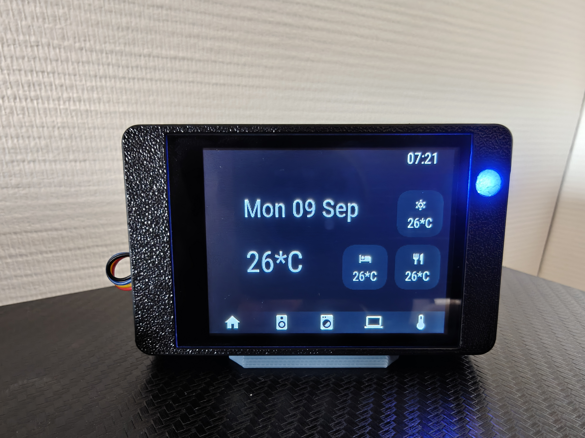
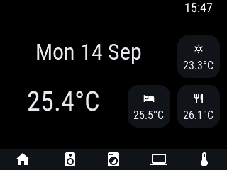
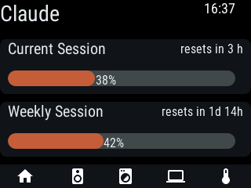
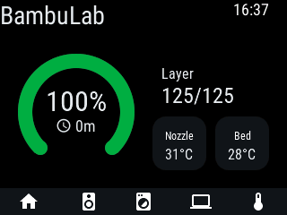
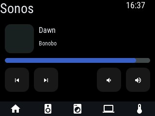

# Guition JC2432W328 openHASP Smart Desk Display 🖥️💡

[](https://www.openhasp.com/0.7.0/hardware/guition/jc2432w328/)
[](https://www.home-assistant.io/)
[](https://open-hasp-studio.vercel.app/)
[](LICENSE)

A compact, highly capable **\$15 smart desk display** based on the **Guition JC2432W328** (ESP32, 2.8" 240x320 capacitive touch LCD). Integrated with **Home Assistant** via **openHASP** to display desk climate, Claude AI API token burn, BambuLab 3D printer real-time progress, and ambient status notifications using the onboard RGB moodlight.

The UI was designed with **[openHASP Studio](https://open-hasp-studio.vercel.app/)**, a drag-and-drop visual editor for openHASP layouts that I built (still a work in progress, but already functional). I've also contributed to the openHASP firmware build files that bring official support for the Guition JC2432W328 hardware.

> 🌐 **Live Website**: Check out the interactive display preview hosted on GitHub Pages!

<p align="center">
  
</p>

---

## ✨ Features

- **🌡️ Desk Climate Monitor**: Indoor/outdoor room temperature, humidity level, and climate indicators.
- **🤖 Claude AI API Usage Tracker**: Monitor daily token consumption and estimated API costs in real time.
- **🖨️ BambuLab 3D Printer Controller**: Track active print file names, progress bar %, nozzle/bed temperatures, and remaining print ETA.
- **💡 RGB Moodlight Notification Halo**: Hardware RGB LED configured as an ambient desk status light (e.g. Amber = Printing, Green = Job Complete, Purple = Claude Alert, Red = Printer Warning).
- **🎨 Visual UI Design**: Created with [openHASP Studio](https://open-hasp-studio.vercel.app/), a drag-and-drop web designer for openHASP layouts that I built and maintain.
- **🛠️ Firmware Contributor**: I've contributed to the openHASP firmware build files that add official support for the Guition JC2432W328.
- **🏠 Two-Way Home Assistant Integration**: Fast state synchronization and action buttons via MQTT.

---

## 🖼️ Gallery

| Home | Claude Usage | BambuLab | Sonos |
| :---: | :---: | :---: | :---: |
|  |  |  |  |

---

## 🛠️ Hardware Specifications

| Component | Specification | Notes |
| :--- | :--- | :--- |
| **Device Board** | Guition JC2432W328 | Cheap Yellow Display (CYD) variant |
| **Microcontroller** | ESP32 (Dual Core, WiFi & BT) | ESP32-WROOM |
| **Display** | 2.8" TFT LCD (240x320 resolution) | ST7789 display controller |
| **Touch Screen** | Capacitive Touch | GT911 touch controller |
| **Moodlight LED** | RGB LED (GPIO 4 / 16 / 17) | Onboard rear/backlight status LED |
| **Enclosure** | 3D Printed Desk Stand | *MakerWorld model link coming soon* |

Official hardware docs: [openHASP Guition JC2432W328 Guide](https://www.openhasp.com/0.7.0/hardware/guition/jc2432w328/)

---

## 📂 Repository Structure

```
├── index.html                  # GitHub Pages landing website with interactive display preview
├── styles.css                  # Responsive dark mode stylesheet
├── script.js                   # Display & moodlight preview logic
├── openhasp/
│   └── pages.jsonl             # openHASP 0.7.0 display page layout definitions
├── home-assistant/
│   ├── openhasp.yaml           # Home Assistant entity & object mappings
│   └── automations.yaml        # Moodlight status & event automations
└── README.md                   # Project documentation
```

---

## 🚀 Quick Start Guide

**Prerequisite**: A working Home Assistant instance with MQTT already set up (e.g. the Mosquitto broker add-on), since the plate talks to Home Assistant over MQTT.

### 1. Flash the Firmware
The hardware/build docs for this board live at [openhasp.com/0.7.0/hardware/guition/jc2432w328](https://www.openhasp.com/0.7.0/hardware/guition/jc2432w328/) (a page I contributed to openHASP).

You have two options:
- **Build it yourself** following the instructions on that page, or
- **Use a pre-built binary**: grab the Guition JC2432W328 artifacts from the [latest openHASP merge request/CI build](https://github.com/HASwitchPlate/openHASP-firmware/actions) for this board.

Flash the firmware using a browser-based tool like [esptool.spacehuhn.com](https://esptool.spacehuhn.com/) — connect the plate via USB-C, select the correct serial port, and flash the `.bin` file.

### 2. Configure the Plate
On first boot, the plate starts its own WiFi hotspot/captive portal. Connect to it and configure:
- **WiFi**: your home network credentials.
- **Moodlight GPIO pinout** (under **Configuration > GPIO Settings**), so the onboard RGB LED is usable:
  - **Mood Red**: GPIO 4 (Group 1)
  - **Mood Green**: GPIO 16 (Group 1)
  - **Mood Blue**: GPIO 17 (Group 1)
- **MQTT**: point it at your Home Assistant/Mosquitto broker (host, port, username/password). This is the prerequisite mentioned above — MQTT must already be running in Home Assistant before this step.

### 3. Discover the Plate in Home Assistant
Install the **openHASP** integration via [HACS](https://hacs.xyz/) (HACS itself must already be installed). Once added, Home Assistant should auto-discover the plate over MQTT and create its device/entities.

### 4. (Optional) Design the UI with openHASP Studio
[openHASP Studio](https://open-hasp-studio.vercel.app/) is my own project — a drag-and-drop visual editor for openHASP layouts, still under active development. Use it if you want to customize the layout instead of using the provided `pages.jsonl` as-is.

1. **Define the plate**: in Studio's settings, set the plate name and screen dimensions (240x320 for this display) so components render to scale.
2. **Connect to Home Assistant**: generate a [long-lived access token](https://www.home-assistant.io/docs/authentication/#your-account-profile) in your HA user profile and paste it into Studio so it can read your entities while you design.
3. **Export**: Studio exports both the `pages.jsonl` UI definition (upload to the device) and the matching Home Assistant YAML (entity/object mappings, e.g. `home-assistant/openhasp.yaml`) to import into your HA config.
4. **Test and finalize**: upload `pages.jsonl` to the plate (via its web interface file manager, at the device's IP address) and confirm the UI renders and responds correctly. Then restart Home Assistant to pick up the new YAML — the plate's buttons/controls should populate as entities.

Import `home-assistant/automations.yaml` as well for automatic Moodlight status alerts.

---

## 📦 3D Printable Enclosure

A custom 3D printed desktop stand with a rear light diffuser for the moodlight LED is available on MakerWorld (*Link publishing soon*).

---

## 📄 License & Acknowledgments

- **openHASP**: Powered by [openHASP](https://www.openhasp.com/). I've contributed to the firmware build files that support the Guition JC2432W328 hardware.
- **openHASP Studio**: The UI editor used to design this project's pages is [my own tool](https://open-hasp-studio.vercel.app/), still a work in progress.
- **Home Assistant**: [Home Assistant Ecosystem](https://www.home-assistant.io/).
- Built with ❤️ for smart home & 3D printing enthusiasts.
